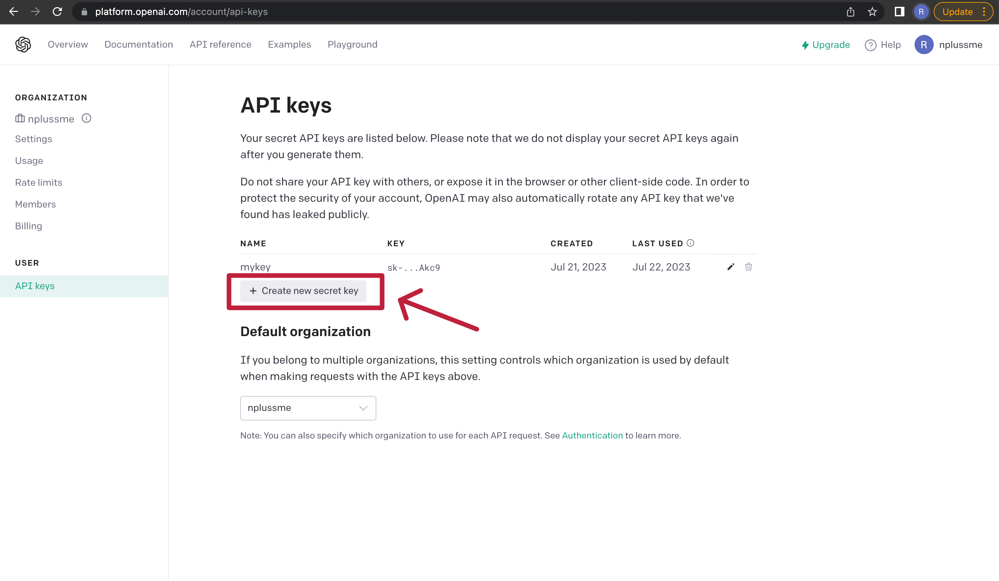

# OpenAI API exploration

## Description:
This project is an exploration of the OpenAI API to use some of its natural language models. The main goal is to demonstrate how to configure the API and use the models to perform various tasks related to text processing, language generation, tex summarization, code generation, and image generation. This repository contains an notebook with a series of tasks and topics that i covered while exploring the API.

## Requirements:
- Python 3.7 or higher
- OpenAI account with API access
- Openai package installed (install with pip install openai)

## Setting:

#### 1. Create an OpenAI account and get your API key. 
To get your API key, go to https://openai.com/ and click on login or register if you don't have an account: 


Once you have your account and login, it will appear the principal products of OpenAI, you need to select the API option as follow image:


The next page will show a welcome message and some options, you need to click on your account options and select the option "View API keys" as follows:


In the API KEYS page, you need to click on the button "Create new secret key":


Then will appear an option to name your API key, you can name it as you want, and then click on the button "Create secret key":


Finally, you will see your API key, you need to copy it and save it in a safe place, because you will need it later.


Besides the API key, you need to know the name of your organization or OrganizationID, to get it, you need to do the following steps:

    
Then you will see the name of your organization or OrganizationID, you need to copy it and save it in a safe place, because you will need.


And that´s all, it was easy right? Now you have your API key and your OrganizationID, you can use them to configure the API and start using the models.

For this project, we gonna use those credentials to configure as a environment variables, so you need to create a file called ".env" in the root of the project and add the following lines:

```bash
OPENAI_API_KEY=YOUR_API_KEY
OPENAI_ORGANIZATION=YOUR_ORGANIZATION_ID
```
2. Set up your virtual environment (recommended). 

```bash
python -m venv venv
source venv/bin/activate (or venv\Scripts\activate.bat for Windows)
```

3. Install the necessary dependencies, including the openai package.

You will find the dependencies in the file requirements.txt, you can install them with the following command:

```bash
pip install -r requirements.txt
```

**Now you can use the notebook to explore the API and models I used, modifies the notebook however you like and have fun!**